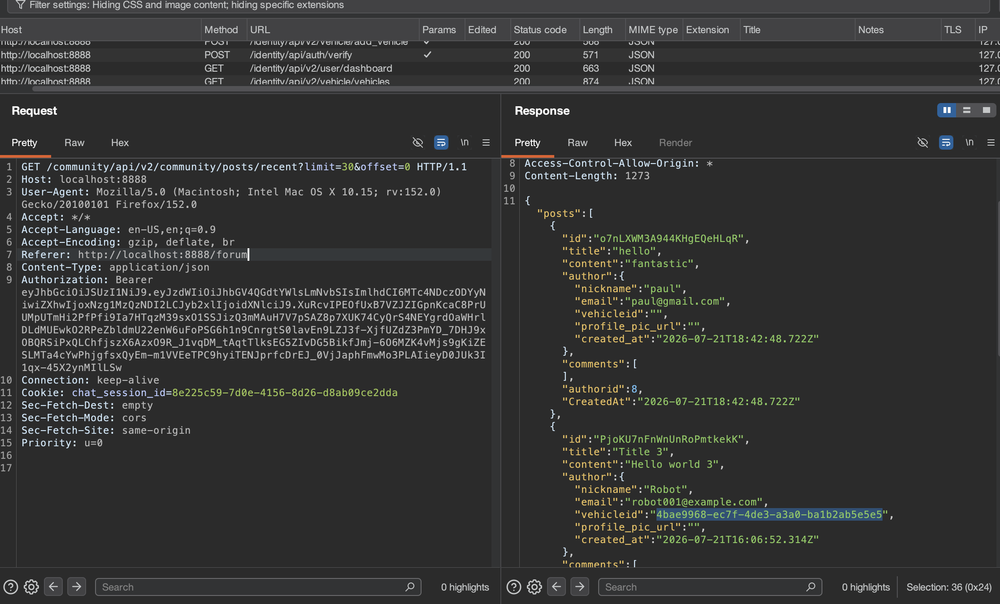
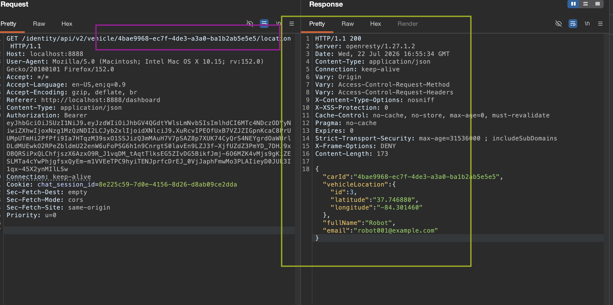
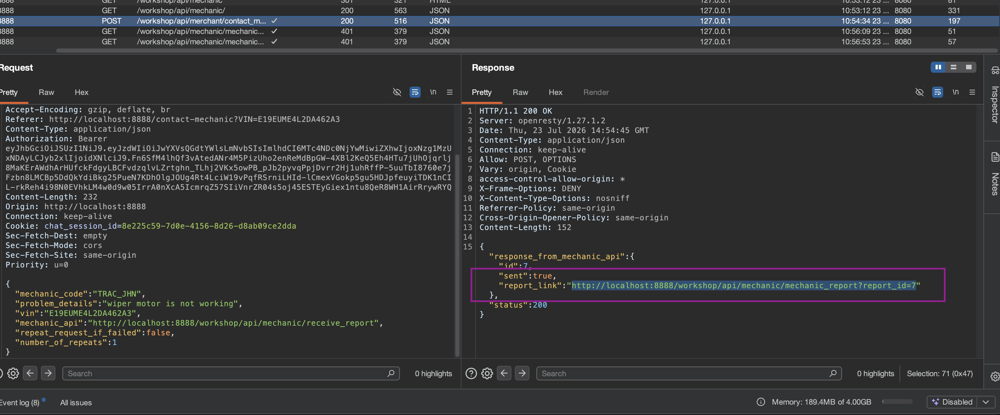
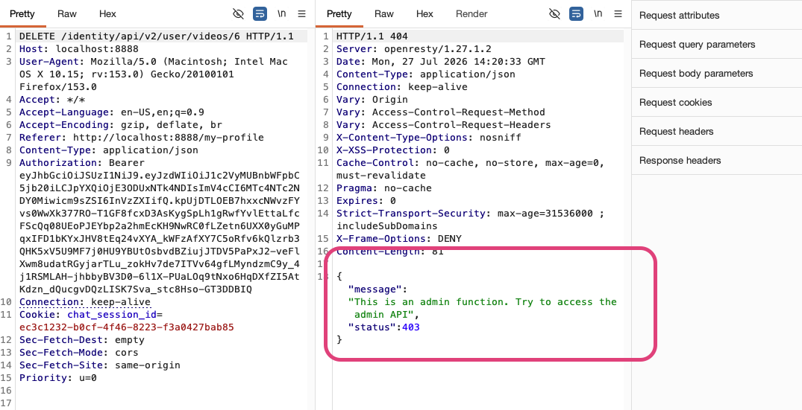

**#API1: Broken object level auth**
BOLA: access to ID. 
BFLA: broken function level authorization.

techniches we should try out: changing http method, or on a diff object. 

it starts from enumeration- discovery, directory busting. 

#API revealing too much data: 

**Using that data/GUID from another user i was able to get location/coordinates for another user's car. **

**Another test for BOLA**

**BOFA**
) 

