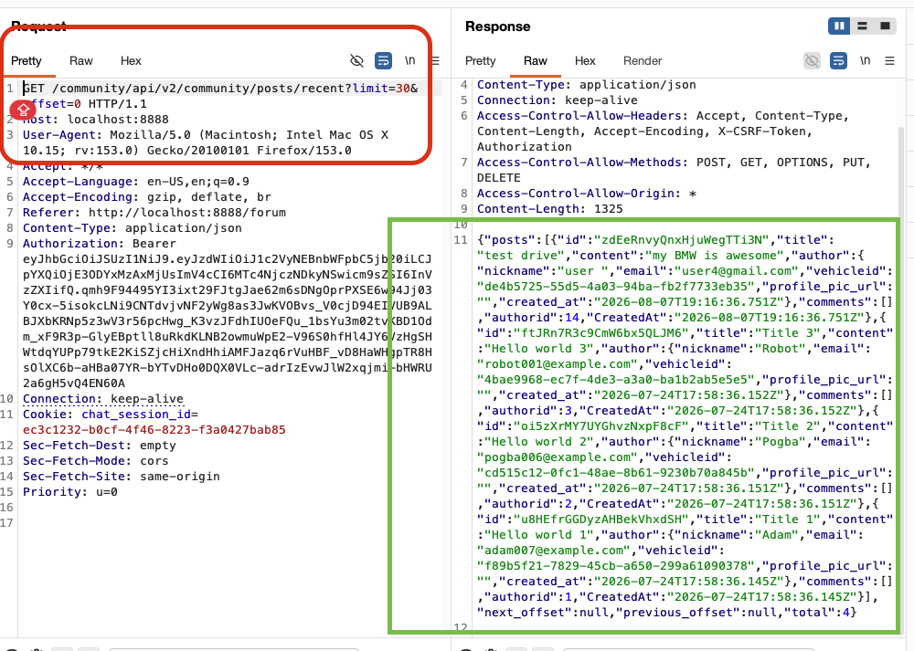
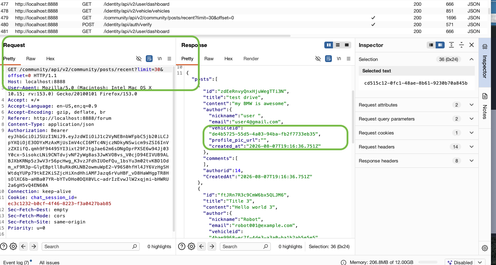
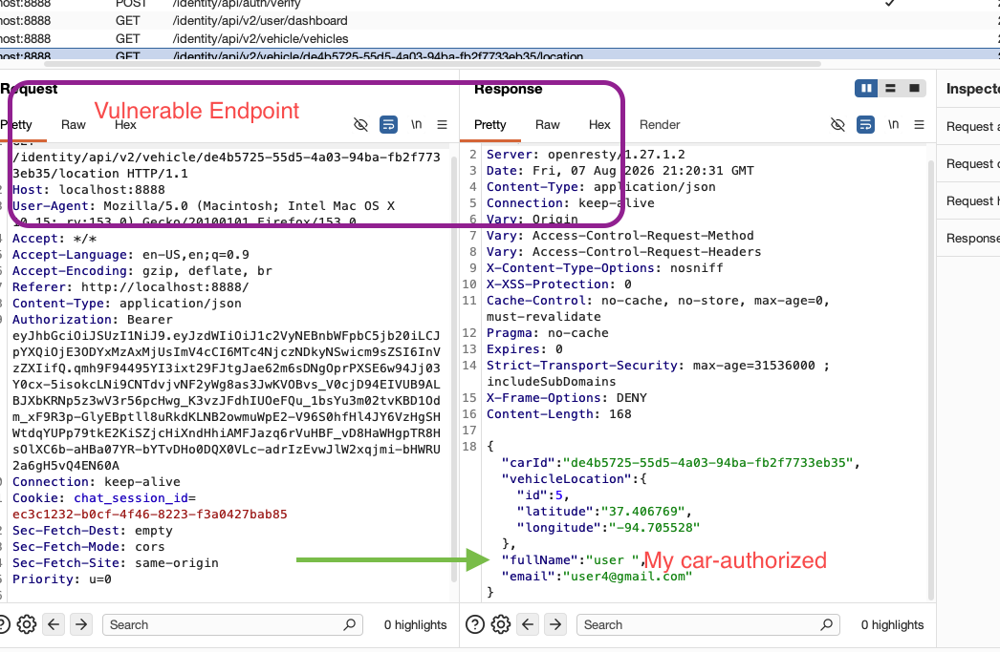
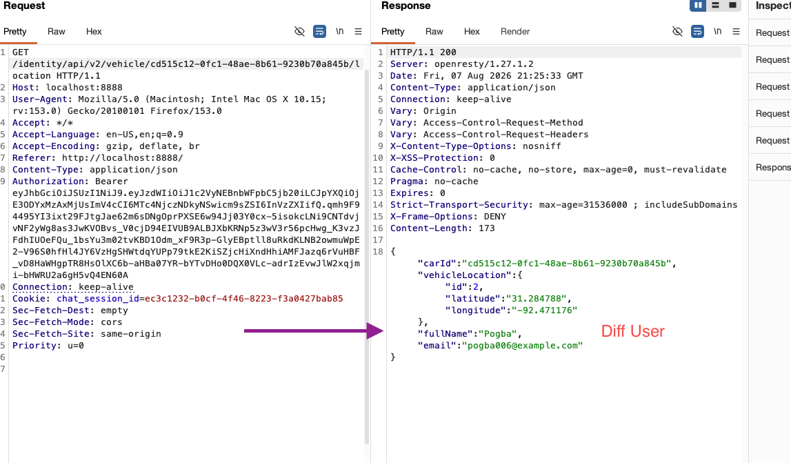
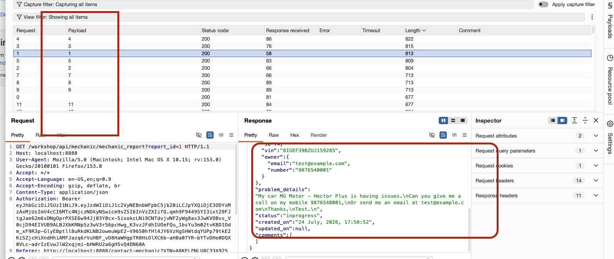
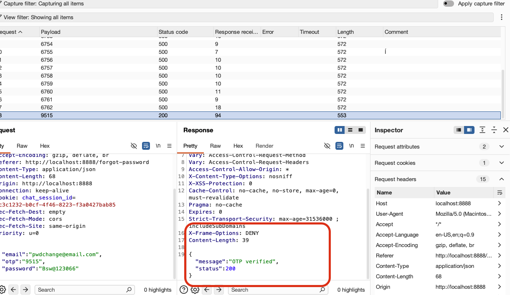

**https://owasp.org/www-project-crapi/**

Challenge 1 - Access details of another user’s vehicle

Task/How: Find an API endpoint that receives a vehicle ID and returns information about it.

*GET /community/api/v2/community/posts/recent?limit=30&offset=0 HTTP/1.1 is revealing information for all the users and there respective vehicles**

this is also an example for excessive data leakage. 

further you can also use the leaked Vehicle ID (guid) and plug it in another endpoint ()
to extract other user's vehicle location.  >> also answers challenge 2 

Challenge 2 - Access mechanic reports of other users
crAPI allows vehicle owners to contact their mechanics by submitting a “contact mechanic” form. This challenge is about accessing mechanic reports that were submitted by other users.

    Analyze the report submission process

    Find an hidden API endpoint that exposes details of a mechanic report

    Change the report ID to access other reports

    Question I wanna figure out: how do i find that vulnerable endpoint, i can fuzz it, 

    I was able to find that endpoint by looking at mechanic reponse page which leaked an API and later I fuzzed on that API by corelating multiple report summition. 
    
  >> Solved, refer above!! 
but there're some advance ways to do this as well:   

-------------
Broken User Authentication
Challenge 3 - Reset the password of a different user

    Find an email address of another user on crAPI

    Brute forcing might be the answer. If you face any protection mechanisms, remember to leverage the predictable nature of REST APIs to find more similar API endpoints.

    >> Multiple ways to do it >> Recon would be great here. 

    I was able to retrive an user id from community post endpoint and used the forget pwd functionality to generate the OTP and knowing the on V2 endpoint there is no rate limiting i was able to brute force/FUZZ the OTP and achived a successful reset.

     
    

