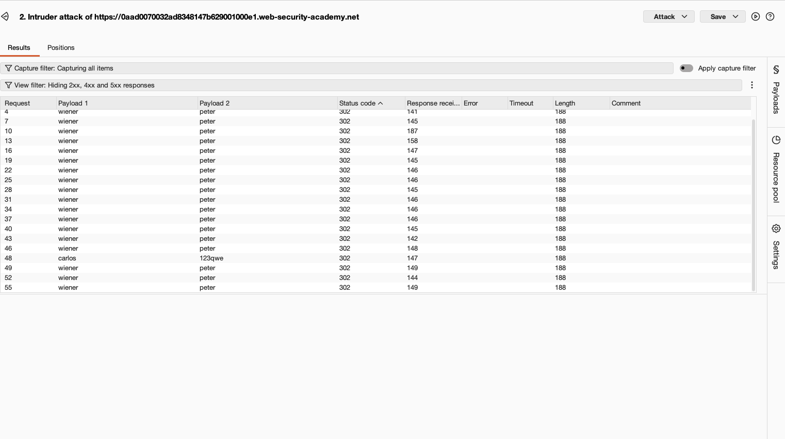
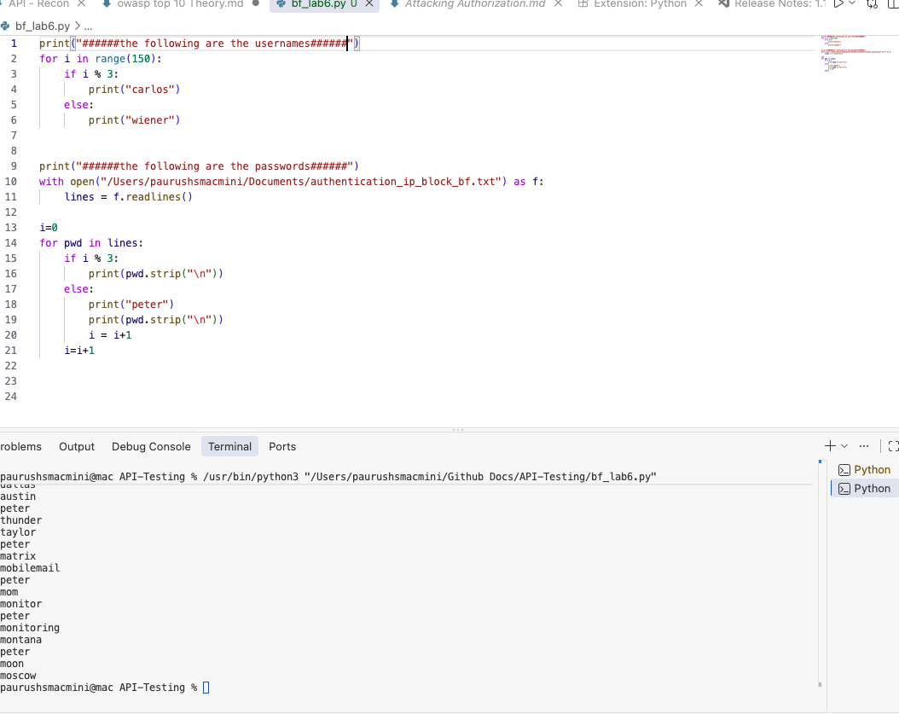

BFLA(Broken object level authorization) auth is implimented at code level mechenism implimented during application is being created, 
it ensures that the user is authorized to perform operation on data sources/endpoint as intented. 

OWASP recommends to automate the evaluation of the authorizations and perform a test when a new release is created. 

